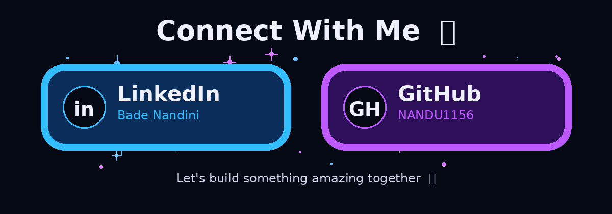

# 👋 Hi, I'm Nandini Bade

  

## 👩‍💻 About Me

🎓 Final-year student passionate about software development.

💻 Interested in Java, JavaScript, MERN Stack and ServiceNow.

🌱 Currently learning modern web development.

🚀 Building projects and improving my coding skills.

🎯 My goal is to become a successful Software Developer.

## 🛠️ Skills

- Java
- JavaScript
- HTML
- CSS
- React.js
- Node.js
- Express.js
- MongoDB
- ServiceNow
- Git & GitHub

## 🚀 Projects

### 🗳️ Real-Time Voting Application

A MERN-based voting application focused on creating a user-friendly and accessible digital voting experience.

**Tech:** React.js | Node.js | Express.js | MongoDB

## 📊 GitHub Stats

  
  
  

## 🔥 GitHub Streak

  

## 🐍 My Contribution Snake

  

## 🌐 Connect With Me

  

  &nbsp;&nbsp;&nbsp;

  

  

