# 👋 Hi, I'm Nandini Bade

  

## 👩‍💻 About Me

🎓 Final-year student passionate about software development.

💻 Interested in Java, JavaScript, MERN Stack and ServiceNow.

🌱 Currently learning modern web development.
## 🌱 Currently Learning

  

  

  

  

🚀 Building projects and improving my coding skills.

🎯 My goal is to become a successful Software Developer.

## 🛠️ Skills

- Java
- JavaScript
- HTML
- CSS
- React.js
- Node.js
- Express.js
- MongoDB
- ServiceNow
- Git & GitHub

**Tech:** React.js | Node.js | Express.js | MongoDB
## 🚀 Featured Projects

<table>
<tr>
<td width="50%">

### 🗳️ Real-Time Voting Application

A MERN-based voting application designed to provide a simple, user-friendly and accessible digital voting experience.

**Tech Stack:**
- React.js
- Node.js
- Express.js
- MongoDB
- REST API

</td>

<td width="50%">

### 💻 Portfolio Website

A personal portfolio website showcasing my skills, projects, learning journey and contact information.

**Tech Stack:**
- HTML
- CSS
- JavaScript

</td>
</tr>
</table>

## 📊 GitHub Stats

  

## 🔥 GitHub Streak

  

## 🐍 My Contribution Snake

  

## 🌐 Connect With Me

  

## 🛠️ Tech Stack

  

  

  

  

  

  

  

  

  

  

  

